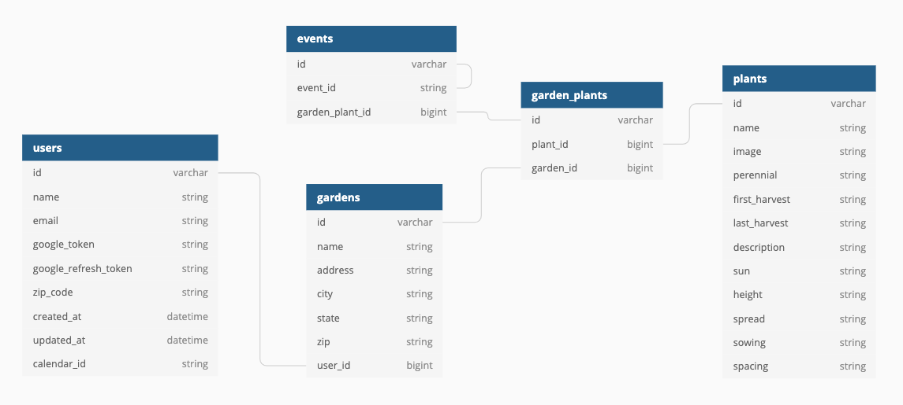

<!-- PROJECT LOGO -->
<br />
<p align="center">
  <a href="https://gardenthat.herokuapp.com/">
    
  </a>
  
  <h1 align="center">Garden That!</h1> <br><br>

GardenThat is an application meant for ANY gardener. Search a selection of fruit and vegetable bearing plants. Add your favorite plants to your Garden. Automated calendar notifications tell you when to expect your first harvest.

<!-- TABLE OF CONTENTS -->
## Table of Contents

* [About the Project](#about-the-project)
  * [Built With](#built-with)
  * [Schema](#schema)
* [Getting Started](#getting-started)
  * [Installation](#installation)
  * [Testing](#testing)
  * [Microservices](#microservices)
* [Usage](#usage)
* [Acknowledgements](#acknowledgements)


<!-- ABOUT THE PROJECT -->
## About The Project

<a href="https://ibb.co/fpgZSxG"></a>

GardenThat is built on a rails framework and uses two separate Sinatra microservices. Our plant microservice houses a database of basic plant information and is tied to GrowStuff's API (see acknowledgments section below). The plant microservice takes in partial or complete searches and returns a list of plants stored in its database. Users can also search plants through a catalog of over 800 plants. Our second microservice ties into the Google Calendars API. A GardenThatApp Google calendar is created the first time users sign in (through Google OAuth) and our second microservice adds notifications to their calendar based on the plants they've added to their garden(s). 

Our Plant MicroService can be found [here](https://github.com/nkeller1/plant_search)

Our Notification MicroService can be found [here](https://github.com/adumortier/notifications)

### Built With

* Frameworks: Ruby on Rails, Sinatra
* Deployment: Heroku
* Database: PostgreSQL
* Testing: RSpec, RackTest, SimpleCov, Capybara (test coverage > 90%.)
* Front-End Design: Bootstrap
* Continuous Integration: Travis CI
* Background jobs/workers: Sidekiq
* Project Management: Trello
* ... and a forge of amazing RubyGems!

### Schema



<!-- GETTING STARTED -->
## Getting Started

To get a local copy up and running follow these simple steps.

### Installation

1. Clone the repo
```sh
git clone https://github.com/adumortier.git
```
2. Install the Gem File
```sh
bundle install
```
3. Create your environment
```sh
rails db:create
rails db:migrate
```
4. Install Figaro
```sh
bundle exec figaro install
```
5. Register your app with [Google](https://console.developers.google.com/) to receive your `client_id` and `client_secret` 

Your `client_id` and `client_secret` keys must be stored securely in the `application.yml` file of your `app/config` directory.

```sh
GOOGLE_CLIENT_ID: <YOUR CLIENT_ID HERE>
GOOGLE_CLIENT_SECRET: <YOUR CLIENT_SECRET HERE>
```
6. Add your keys to your app on Heroku 
```sh
figaro heroku:set -e production
```

### Testing

1. Install RSpec

```sh
bundle install rspec
```
2. Run the test suite from the root directory of the repository

```sh
bundle exec rspec
```
### Notification Microservice Access Points 

Retrieve the events from the GardenThatApp calendar:
```sh
GET https://notificationmicroservice.herokuapp.com/events/info?token=<your_google_token_here>&refresh_token=<your_google_refresh_token_here>&calendar_name=GardenThatApp
```
Create a new calendar:
```sh
POST https://notificationmicroservice.herokuapp.com/calendar/new?token=<your_google_token_here>&refresh_token=<your_google_refresh_token_here>&calendar_name=<calendar_name_here>
```

Create a new event (date format yyyy-mm-dd):
```sh
POST https://notificationmicroservice.herokuapp.com/event/new?token=<your_google_token_here>&refresh_token=<your_google_refresh_token_here>&name=<event_name_here>&description=<event_description_here>&date=<date_here>

```
Delete an event:
```
DELETE https://notificationmicroservice.herokuapp.com/event/info?token=<your_google_token_here>&refresh_token=<your_google_refresh_token_here>&calendar_id=<calendar_id_here>&event_id=<event_id_here>
```
### Plant Microservice Access Points 

Get All Available Plants:
```
GET https://plantmicroservice.herokuapp.com/allplants
```

Query One Plant:
```
GET https://plantmicroservice.herokuapp.com/plant/REQUEST 
```

Get a selection of 10 results that match a partial:
```
GET https://plantmicroservice.herokuapp.com/api/REQUEST 
```

<!-- USAGE EXAMPLES -->
## Usage

As a visitor, you can search for and browse the plants we currently have available. If you want to create a garden, sign up! You may create as many gardens as you wish.  If you find a plant that you want to add to a garden, navigate to the plant's detail page and click 'Add plant to my garden'. Once the plant has been added our background workers will automatically add the estimated best time to harvest your plant to your calendar. 

Future iterations will include: 
* a watering schedule for the plants in your garden(s). 
* recommendations based on your location
* suggestions based on the plants you already have in your garden
* a 'Tips' section on how to get the most out of your garden
* an entire GardenThat community!

<!-- ACKNOWLEDGEMENTS -->
## Acknowledgements

* [GrowStuff.org](https://www.growstuff.org/)
* [Google Dev](https://console.developers.google.com/)
* Gabz Cirbo for designing the GardenThat logo! 

## Developer GitHub Profiles

* Paul Debevec - [GitHub](https://github.com/PaulDebevec) <br>
* Alexis Dumortier - [GitHub](https://github.com/adumortier)<br>
* Nathan Keller - [GitHub](https://github.com/nkeller1)<br>
* Will Kunz - [GitHub](https://github.com/willkunz13)<br>

Deployed Application on Heroku: [GardenThat!](https://gardenthat.herokuapp.com/)
